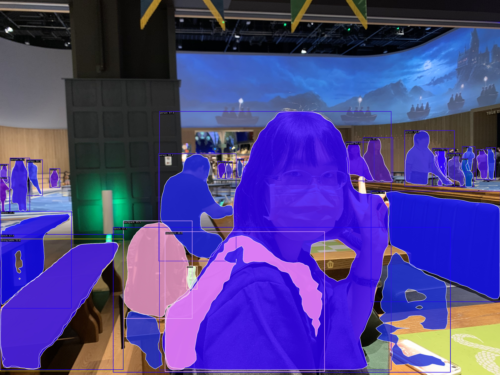

Please use this alongside my HackMD notes - [Using WSL to Run MMDetection on CPU](https://hackmd.io/@NYTCEE/HJSWzJFFJe)
## Detect Image Using Instance Segmentation
| harrypotter.jpg | seg_harrypotter_result.jpg |
|-------|-------|
|  |  |
## Detect Video Using Instance Segmentation
| art.mp4 | seg_art.mp4 |
|-------|-------|
|  |  |
